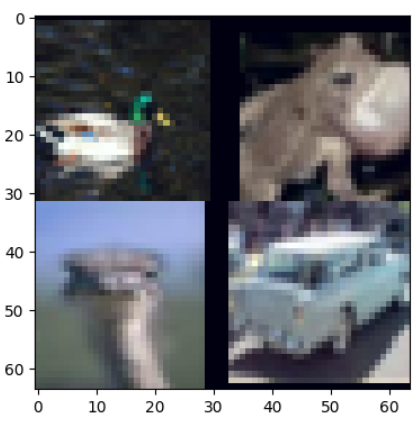
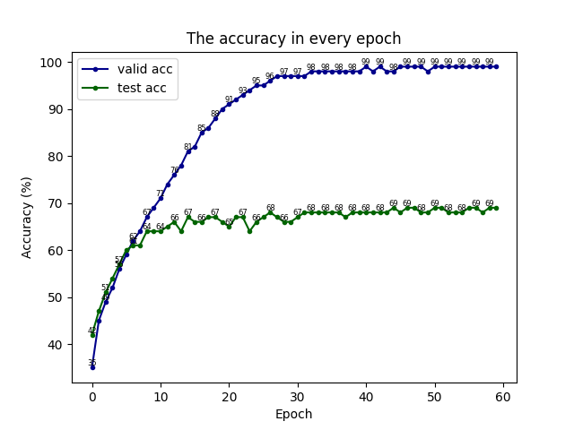
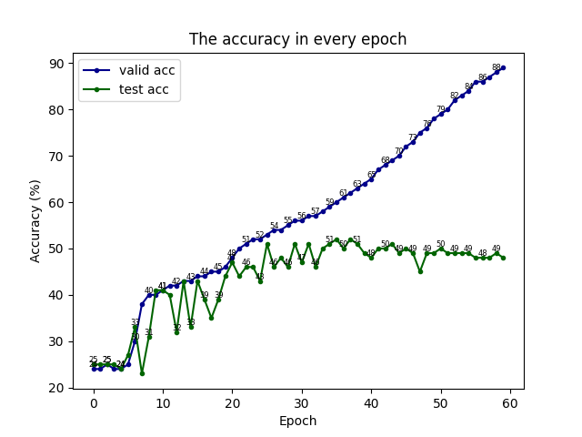
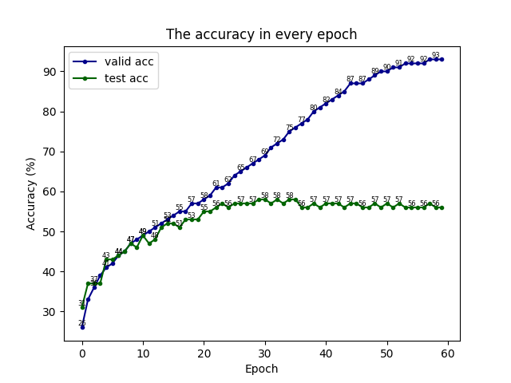

# Image Classification of Animal Species

# 1. Introduction

This project was a coursework for my course credit and was completed during my master's degree in Advanced Computer Science at Newcastle University. The main content of the project is about image classification using machine learning methods. 

Coursework Specification: The CIFARTile dataset is an extension to the CIFAR10 dataset. In each image there are four CIFAR10 images tiled in a grid, as shown in the following picture. The label is the number of unique CFAR10 image classes within the tiled image subtract one. For example, as shown in the following picture, there are two images of birds, one of a frog and one of an automobile. Thus, three unique classes and hence the label is 2. Additionally, cutting the image up into 4 and running each through a CFAR10 classifier is not allowed by the module leader and lectures.

# 2. Solution

In this project, I opted for Pytorch as the primary deep learning framework and employed various deep convolutional neural networks for image classification tasks, aiming for further analysis and comparison. Before training each model, I always performed a series of data preprocessing steps, especially normalizing the images to ensure every pixel value falls within the range of 0 to 1. Subsequently, I efficiently loaded the data using PyTorch's DataLoader functionality. In terms of model architecture, I chose the deep convolutional neural networks VGG, Resnet, and Densenet, and appended an activation function afterwards to optimize the classification results. During the model training process, I not only selected appropriate optimizers and loss functions but also continuously monitored the performance on both the training and validation datasets to ensure stable learning of the model. Ultimately, after the model training was complete, I applied it to the test dataset to validate its predictive capability in real-world applications and visualized the results to present the learning outcomes.

# 3. Result

The following picture displays the training and prediction results of the VGG model.

The following picture displays the training and prediction results of the Resnet model.

The following picture displays the training and prediction results of the Densenet model.

